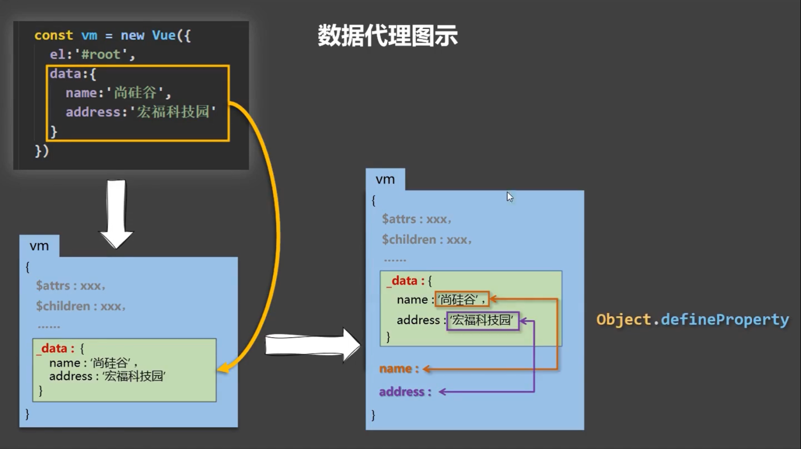

## Object.defineProperty

```js
let number = 18
let person = {
  name: '张三',
  sex: '男'
}

Object.defineProperty(person, 'age', {
  // value: 18,
  // enumerable: true, // 控制属性是否可以枚举，默认值是 false
  // writable: true, // 控制属性是否可以被修改，默认值是 false
  // configurable: true // 控制属性是否可以被删除，默认值是 false

  // 当有人读取 person 的 age 属性时，get 函数 (getter) 就会被调用，且返回值就是 age 的值
  get() {
    console.log('有人读取 age 属性了')
    return number
  },

  // 当有人修改 person 的 age 属性时，set 函数 (setter) 就会被调用，且会收到修改的具体值
  set(value) {
    console.log('有人修改了 age 属性，且值是', value)
    number = value
  }
})
```

## 何为数据代理

数据代理：通过一个对象代理对另一个对象中属性的操作（读/写）

```js
let obj = { x: 100 }
let obj2 = { y: 200 }

Object.defineProperty(obj2, 'x', {
  get() {
    return obj.x
  },
  set(value) {
    obj.x = value
  }
})
```

## Vue 中的数据代理

```
1.Vue 中的数据代理：
  通过 vm 对象来代理 data 对象中属性的操作（读/写）
2.Vue 中数据代理的好处：
  更加方便的操作 data 中的数据，否则每次读取 data 中的数据，都需要写成 _data.xxx
3.基本原理：
  通过 Object.defineProperty() 把 data 对象中所有属性添加到 vm 上。
  为每一个添加到 vm 上的属性，都指定一个 getter/setter。
  在 getter/setter 内部去操作（读/写）data 中对应的属性。
```

Vue 将 data 中的数据拷贝了一份到 _data 属性中，又将 _data 里面的属性（如 name）提到 Vue 实例中，通过 defineProperty 实现数据代理，这样通过 getter/setter 操作 name，进而操作 _data 中的 name。而 _data 又对 data 进行数据劫持（修改 data 的属性，页面用到该属性的地方自动更新），实现响应式


