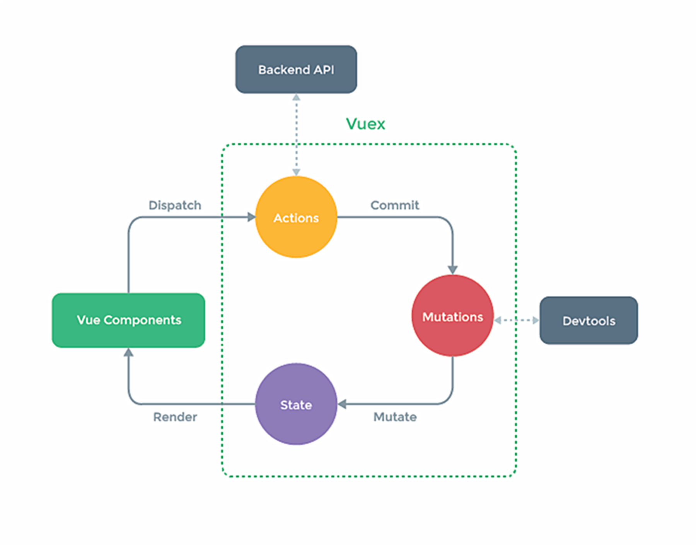

Vuex 工作原理图



### 3.搭建 vuex 环境

1. 创建文件：`src/store/index.js`

   ```js
   //引入 Vue 核心库
   import Vue from 'vue'
   //引入 Vuex
   import Vuex from 'vuex'
   //应用 Vuex 插件
   Vue.use(Vuex)

   //准备 actions 对象——响应组件中用户的动作
   const actions = {}
   //准备 mutations 对象——修改 state 中的数据
   const mutations = {}
   //准备 state 对象——保存具体的数据
   const state = {}

   //创建并暴露 store
   export default new Vuex.Store({
     actions,
     mutations,
     state
   })
   ```

2. 在`main.js`中创建 vm 时传入`store`配置项

   ```js
   ......
   //引入 store
   import store from './store'
   ......

   //创建 vm
   new Vue({
   	el:'#app',
   	render: h => h(App),
   	store
   })
   ```
